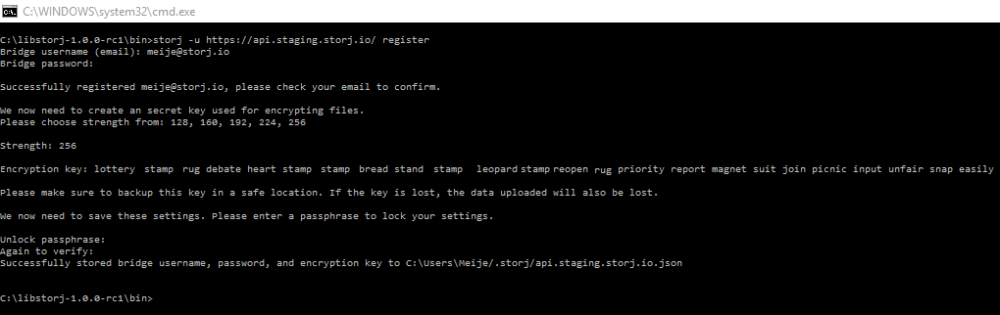

# *Asynchronous multi-platform C library and CLI for encrypted file transfer on the Storj network*

-----------------
## *The Storj Team*

# 1. Introduction

For the last few years Storj Labs has continuously strived towards producing
better code and tools that are easier to use, have more functionality, security
and increased performance. Currently two main CLI packages released by Storj
exist which can be used to interact with the Storj network (e.g. uploading,
downloading, streaming). The first package that was released was [core-CLI](
(http://www.github.com/Storj/core-cli)), which
is a JavaScript tool written on top of NodeJS to interact with the network.
Although core-CLI is still fully functional, is has currently been surpassed by
[Libstorj](http://www.github.com/Storj/libstorj), a new
library and CLI written in the *C programming language* By Braydon Fuller and
Alexander Leitner. Below are some bullet points on the advantage and
disadvantage of Libstorj compared to core-CLI.

**Advantages**

-   Does not require extra disk space to upload a file.
-   Low memory consumption.
-   Much faster encryption and hashing speeds.
-   Does not require the installation of any dependencies.
-   More secure by using the seed for file and bucket encryption instead of keyring.
-   All keys are encrypted.

**Disadvantages**

-   It currently has less build-in functionality than core-CLI.

Although core-CLI has more functionality at the moment, Libstorj is still in the
Alpha pre-release phase and many more functions will be added in the near
future. In this guide we will walk through the process of (1) Downloading and
running Libstorj, (2) Exporting an account from core-CLI and importing it into
Libstorj, (3) Registering a new user with Libstorj, (4) Encryption keys path and
working with multiple bridge accounts, (5) Adding a bucket, uploading and
downloading a file, (6) Deleting a buckets or files within a bucket, (7) Listing
mirrors, (8) Streaming an audio or video file, (9) Exporting the decrypted keys,
(10) Exploring the additional Libstorj options and commands, (11) Connecting to
a different bridge, (12) Configure billing to upload/download beyond the free
tier limit.

# 2. Downloading and running Libstorj

Libstorj can be downloaded from the Github repository at [Libstorj releases](https://github.com/Storj/libstorj/releases). Under *"downloads"* download the
latest Libstorj release for your specific system (Figure 2.1).

Figure 2.1. Download the latest release for your specific system.

-   After downloading extract the folder to the location of your choice.
-   Depending on your system, enter the extracted directory with the command line (cd to 	the directory), this main directory contains a `"bin"`, `"include"` and `"lib"` subdirectory.
-   Enter the `"bin"` directory, this directory contains the Libstorj executable called 	`"Storj"` (Figure 2.2).

	

	Figure 2.2. CD to the "bin" directory within the extracted main directory.

-   Next call Storj by typing in `"Storj --help"`, if all goes well Libstorj should now 	return the list of functions, settings and options (Figure 2.3).

	

	Figure 2.3. Libstorj "help" command output.

That’s it! Libstorj is now installed and working (not configured yet though).

# 3. Exporting an account from core-CLI and importing it into Libstorj

If one is already using core-CLI it is possible to import the seed into Libstorj
to be able to access the files uploaded with core-CLI in the following way:

## 3.1 Core-CLI

First it is necessary to generate and print the seed in core-CLI before it can
be imported into Libstorj, this can be done in the following way:

1.  Open a terminal.
2.  Type in `"Storj generate-seed"`.
3.  Next type in `"Storj print-seed"`.
4.  Copy the super-secret seed/decryption key (Figure 3.1) and paste it into a text file 	that is in a safe location (e.g. USB stick, SD card, piece of paper).

	

	Figure 3.1. Print the core-CLI seed.

## 3.2 Libstorj

5.  CD back to the Libstorj `"Bin"` directory.

6.  Run `"Storj import-keys"`.

7.  Type in the `"bridge username:"` (email address) with which you registered an account on the bridge ([app.storj.io](https://app.storj.io)).

8.  Now type in the bridge account password in `"Bridge Password:"` corresponding to the email address in the step above.

5.  In `"Encryption key:"` paste the seed and press enter.

6.  Your super-secret seed and bride password have to be encrypted so that someone that has access to your computer can’t steel your seed, which would give him or her complete access to your files. In `"unlock passphrase:"` type a secure password (e.g. do not include your birthday or family name) that is only known to you.

7.  Next type the password again in `"Again to verify:"` to confirm your password matches to the password in the previous step. Press enter again to finish the importing process.

8.  Libstorj should now return a message that all parameters are safely stored on your 	computer (Figure 3.2).

	

	Figure 3.2. Migrating from core-CLI to Libstorj by importing the keys.

# 4. Registering a new user with Libstorj

If you do not already have an account on the Storj Bridge, you can easily
register a new account via bridge-GUI ([app.storj.io](https://app.storj.io)) or via the
Libstorj-CLI command line in the following two ways:

## 4.1 Register an account via the Libstorj command line

To register a bridge account via Libstorj simply CD back to the Libstorj `'bin'`
directory and execute the following command:

- `Storj register`

**Now the registration process can begin:**

1.  In `"Bridge username (email):"` enter your email address and press enter.
2.  In `"Bridge password:"` enter a password of your liking (please do not forget the password) and hit enter again. This should return the following message:
	
	> *"Successfully registered <your email address>, please check your email to confirm."*
	
3.  Now check your email inbox and click on the activation link send by the Storj-Bridge to activate your account. Note that sometimes the email is moved to the 'trash' folder.
4.  In `"Strength"` type in `"256"` and press enter. This will create a 256 bit encryption key.
5.  The encryption key (seed) will now be printed in the command terminal:
	
	
	> *"Encryption key: drive ghost cannon address decrease illness raw motion detail home lady mountain vehicle logic clock lunch pioneer float ivory curious scheme rice early solution"*
	
6.   Next backup the seed/decrypted encryption key to a very safe location	(preferentially offline), the key is vital as all files are encrypted using the seed, if it is lost, so are all the uploaded files.
7.  Now the decrypted encryption key and bridge account password have to be encrypted with a password. Libstorj will now print out the following line:

	> We now need to save these settings. Please enter a passphrase to lock your settings.`
	
8.  In `"Unlock passphrase:"` type in a secure password of your liking and press enter.
9.  Enter the password again in `"again to verify:"` and press enter.
10.  Libstorj should now print out the following success line indicating that the settings are successfully saved to our computer (Figure 4.1):

	> *"Successfully stored bridge username, password, and encryption key to C:\\Users\\USER/.storj/api.storj.io.json"*

Figure 4.1. Registering a new user with Libstorj.

That’s it, you are now registered to the Storj-Bridge and can begin uploading
and downloading files, you can skip chapter 4.2.

## 4.2 Registering an account via Bridge-GUI ([app.storj.io](https://app.storj.io))

If you prefer to register an account using a more graphical user interface it is possible to register directly via bridge-GUI by clicking on [app.storj.io](https://app.storj.io) or pasting (app.storj.io) into a web-browser (Figure 4.2).

Figure 4.2. Bridge-GUI (app.storj.io) main Login window, click on 'Sign Up'.

Click on the `"Sign Up"` link (Figure 4.2). Once on the registration page enter
your email address and password, click on the box to agree to the terms of
service and finally click on `"Sign Up"` (Figure 4.3).

Figure 4.3. Bridge-GUI (app.storj.io) main registration page.

Now check your email inbox and click on the account activation link send by
Storj. A web-page should open with the account activation confirmation. Note
that sometimes the email is automatically moved to the spam/trash folder by some
email providers so if the email is not in the inbox make sure to check that. Now
that the bridge account is created you can login into bridge-GUI (Figure 4.2 and
4.4).

Figure 4.4. Bridge-GUI (app.storj.io) dashboard.

*Now that you are successfully registered on the bridge it is necessary to
import the bridge account into Libstorj. This can be done in the following way:*

1.  CD back to the Libstorj `"Bin"` directory.

2.  Run the `"Storj import-keys"` command.

3.  In `"bridge username"` type in the email address with which you registered an account on the bridge (app.storj.io) and press enter.

4.  In `"Strength"` type in `"256"`. This will create a 256-bit encryption key (seed).

5.  The encryption key will now be printed to the command terminal, e.g.:

	> *"Encryption key: gesture helmet spread bonus claw invest donate federal tribe better step first simple shock body sock noodle bubble buddy west cruel lounge mango rebel"*

6. 	Next backup the decrypted encryption key to a very safe location (preferentially 	offline), the key is vital as all files are encrypted using this key, if it is lost, so 	are all the uplo	aded files.

7.  Now the seed/decrypted encryption key and bridge account password must be encrypted 	with a 	*password*. Libstorj will now print out the following line:

	> *"We now need to save these settings. Please enter a passphrase to lock your settings."*

8.  In `"Unlock passphrase:"` type in a secure password of your liking and press enter.

9.  Enter the password again in `"again to verify:"`

10. Libstorj should now print out the following success line indicating that the settings are successfully saved to our computer (Figure 4.5):

	
	> *"Successfully stored bridge username, password, and encryption key to C:\\Users\\USER/.storj/api.storj.io.json"*
	

Figure 4.5. Setting up the Libstorj account by importing the bridge-GUI
(app.storj.io) keys (username plus password).

Congratulations, you now registered an account to Storj via app.storj.io and
have successfully imported the keys into Libstorj.

# 5. Encryption keys path and working with multiple bridge accounts

## *5.1 Libstorj keys location*

The encrypted keys are saved in a file called `"api.storj.io.json"` in the
user’s account (e.g. `"C:\Users\User\.storj"` in windows or `"~/.storj"` in Linux). The save path location is printed out after successfully executing the `"Storj import-keys"` or `"Storj register"` commands (e.g. Figures 3.2, 4.1, 4.5). The file contains the
encrypted bridge password and encrypted seed/mnemonic. The contents of this file
should look like this:

	> { "user": "meije@storj.io", "pass": "48718fb5236407cd22b44d6cc9558933a11edbe431a76123495ac212bf346a7f531dbbd2374492fc76b521ff8425f77258d395f810a605de78", "mnemonic": "3d2c9d3dfc21d23ff937e7fa5cb97f7859037ae46b63b84b45adbd8f9caa350506438fcb4a95c9123a43ee0ab95783a94434f13f0bc6cd18c5a2db2017c5450d062168b38bc82e2456525c7c248d39776dc86aa7992e379be175eb8675fd8668433a0dc95c1cf0d61947622a0ebdc40e575f35f44263ca8921aa8a7a0069cc" }

## 5.2 Working with multiple bridge accounts

If one has multiple Storj bridge accounts and wants to quickly switch between
the accounts it is possible to save the encryption keys file or just its content
to a different location and when needed quickly substitute the file or file
content of another bridge account, this prevents the necessity of having to go
through the entire key import process every time. As these keys are securely
encrypted the file and its content can be stored safely anywhere (do not forget
the decryption key for each account though). The workflow of this process would
go as follows:

1.  Import the keys of the first bridge account covered in the previous chapters (if you did not do this already).

2.  Copy the `"api.storj.io.json"` file or its content to another location.

3.  Execute the `"import-keys"` command again for the second bridge account and say `'y'` 	(yes) to overwrite the `"api.storj.io.json"` file.

4.  Follow all the key import steps for the second bridge account covered in the    	previous chapters.

5.  Once done save the `"api.storj.io.json"` file containing the keys of your second bridge 	account to the folder in step two. Note that it is advisable to temporary rename the 	files or place them in different sub-directories (e.g. `"main bridge account"` and `"secondary bridge account"`). Remember to rename the file back to the original name 	when they are placed back to the Libstorj directory.

# 6. Adding a bucket, uploading and downloading a file.

In the next few sub-chapters we will create a bucket, upload a file to it and
finally download the file back to our computer.

## 6.1 Adding a bucket

A Storj bucket allows to group files together and place them is a common
container (bucket), much like is the case with folders and directories on a
computers, although you can’t create sub-buckets as you would create a
sub-directory. A Storj bucket can be filled with files by uploading to the
bucket using the bucket-ID of the bucket. Storj does not support folder and directory
structures so only files can be uploaded to a bucket, however, if one wants to
upload a folder, the easiest solution is to create a `.zip` or `.rar` archive of the
folder one wants to upload. The other advantage of this is that the files are
compressed when they are converted into a `zip` or `rar` archive, this will
save allot of money when uploading extensive amounts of data to the network.

We can add a bucket in one of the two following ways:

1.  **Adding a bucket via the Libstorj terminal** 

	Adding a bucket via the Libstorj terminal is straight forward, and can be done by executing the following command within the Libstorj `"Bin"` directory:

	- `Storj add-bucket <bucket name>` 
		>*e.g. "Storj add-bucket myFiles"*

2.  **Adding a bucket via bridge-GUI ([app.storj.io](https://app.storj.io))**

	i. A bucket can also be added directly via `"app.storj.io"` in the following way:

	ii. On the dashboard click on the *large green button* called `"Create bucket"`
    (Figure 4.4).

	iii. Next bellow `"Bucket name"` enter the name you want to call your bucket.

	iv. Click on `"Save bucket"` (Figure 6.1).

Figure 6.1. Add a bucket to your account via app.storj.io.

## 6.2 Uploading a file

There are a few scenarios that have to be considered in this step, the first one
is what exactly do you want to upload and how many files you want to upload.
Examples of this include:

1.  I want to upload only one or two files and I don’t mind uploading one after the other having to execute a new upload command every single time.
2.  I want to upload hundreds of files.
3.  I want to upload video or audio files that I want to stream back to my computer later down the line.
4.  I want to upload hundreds of files that I want to access very frequently.
5.  I want to upload an entire folder.

In (1) it is best to upload the files directly without compressing them into a
`.zip` or `.rar` archive. in (3) It is not possible to stream a file that is uploaded
within a compressed `.rar` or `.zip` container, in that case it is better to compress
the audio or video directly into a different *codec*. In the case of (2) and (5) it
is definitely worth compressing the files or folder because not only will the
compressed file become smaller, it also prevents having to upload hundreds of
files one by one (and then downloading them one by one) which is a very tedious
task if you don’t have an automated script for it. In the case of (4) you will
have to upload the files one by one or create an upload/download script until
recursive uploading/downloading is implemented into Libstorj.

The workflow of uploading a single file goes as follows by executing these
commands:

1.   `"Storj list-buckets"`, figure 6.2. This will print a list of all our created buckets 	with their names and ID’s.

2.	Next enter the *password* to unlock the settings and press enter (see tip in 6.2.1).

	

	Figure 6.2. Listing the buckets in our bridge account.

3.	`"Storj upload-file <bucket-ID> <pathToFile>"`

	> e.g. *"Storj upload-file 37be365e5d28fa9450ef0487 C:\\libstorj-1.0.0-rc1\\bin\\storj.exe"*

-   *Next enter the password to unlock the settings and press enter.*

**Note:** Do not forget to add the file name to the path, just the directory
path which contains the file will not work.

The file will now start hashing, once that is done the upload will start. The
progress bar will slowly move towards 100%. Once uploaded successfully Libstorj
will return an `"Upload success!"` message (Figure 6.3).

Figure 6.3. Uploading a file.

**Warning:** If the path to the file you want to upload contains a space it is
necessary to put the path to the file between parentheses (“path”)

> *e.g. "Storj upload-file 37be365e5d28fa9450ef0487 “C:\\libstorj1.0.0-rc1\\bin\\storj.exe” "*

**Note:** To get more information regarding the upload process it is possible to add the `"--debug"` option to the upload command as follows:

- `Storj --debug upload-file <bucket-ID> <pathToFile>`

	> *e.g. "Storj --debug upload-file 37be365e5d28fa9450ef0487 C:\\libstorj-1.0.0-rc1\\bin\\storj.exe"*

*The log-level output in debug mode can also be changed using ‘--log' in the
following way:*

-	`Storj --debug --log upload-file <bucket-ID> <pathToFile>`

	> *e.g. "Storj --debug --log 3 upload-file 37be365e5d28fa9450ef0487 C:\\libstorj-1.0.0-rc1\\bin\\storj.exe"*

**This is especially handy for troubleshooting purposes.**

*The process of uploading other files will be the same, of course the file
names, extensions, Bucket-IDs and file locations will differ. Uploading a zip
file, audio or video files are all done in the exact same way. You might want to
create different buckets for different file types to organize your file
library.*

### 6.2.1 Uploading to a bucket created with Core-CLI

If you followed chapter three and you imported the seed from core-CLI it will be possible to upload to this bucket even though the bucket itself is not decrypted by Libstorj and it will say `"Decrypted: False"`. Bucket ID’s and names created by Libstorj are now tied together, meaning that the hashing of the bucket-ID is done based on the bucket name. This was not yet the case with Core-CLI and thus Libstorj gets confused when seeing a Core-CLI bucket, don’t worry about this, as long as you imported the seed and the bridge credentials are ok you will be fine!

### 6.2.2 Setting the settings password as environment variable

If you are tired of setting having to enter the decryption password every single time it is possible to set the password to an environment variable in the following two ways:

1.  Permanents variable, it will be saved to the system even if one exits the command 	line and opens a new one later. To do this execute the following command:

	- `setx STORJ_KEYPASS <your password>`
	
		> *e.g. "setx STORJ_KEYPASS supersecretpassword"*

2.  Temporary variable, the variable is only valid within the current command line 	terminal. To do this execute the following command:

	- `set STORJ_KEYPASS=<your password>` 
		> *e.g. "setx STORJ_KEYPASS=supersecretpassword"*

This last option is the safest because once the terminal is closed the password
will be gone and no one will be able to discover your password by going to the
system variables menu.

Note that there are also other Libstorj variables that can be set in a similar
way (Figure 6.4).

Figure 6.4. Libstorj environment variables.

## 6.3 Downloading a file

Now that we uploaded a file to a specific bucket we can download the file within
that bucket. We know from chapter 6.2 that the file in this example was uploaded
to the bucket called *"MyFiles"* with `ID: 37be365e5d28fa9450ef0487`, and thus
the file will be located within that bucket. If you are not certain anymore to
which bucket you uploaded the file you can easily find it by executing the
following commands:

1.  `Storj list-buckets`

2.  `Storj list-files <bucket ID>`

	>   *e.g. "Storj list-files 37be365e5d28fa9450ef0487", figure 6.5.*

	

	Figure 6.5. List all files in a bucket.

We now know the ID of the bucket which contains the file and the file-ID. These
are the two pieces of information needed to be able to download a file. *We now
need to know where we want to download the file to*. The file can be downloaded
in the following way:

-   `Storj download-file <BucketID> <FileID> <path to save file>`

	>   *e.g. "Storj download-file 37be365e5d28fa9450ef0487 b1cee94a4c949b7171598c8a C:\libstorj-1.0.0-rc1\\bin\\downloaded\\storj.exe", figure 6.6.*

	

	Figure 6.6. Downloading a file with Libstorj.

**Warning:** If the path to which you want to download the file contains a space
it is necessary to put the download path between parentheses (“path”).
	
> *e.g."Storj download-file 37be365e5d28fa9450ef0487 b1cee94a4c949b7171598c8a “C:\\libstorj-1.0.0 rc1\\bin\\downloaded\\storj.exe" "*

**Note:** Do not forget to add the filename to the path you want to download the
file to, if you don’t add the filename Libstorj will report that it can’t
perform the download task at it is trying to create a directory from a file,
which will not work.

To get more information regarding the download process it is possible to add the `"--debug"` option to the download command as follows:

-   `Storj --debug download-file <Bucket ID> <File ID> <path to save file>`

	>   *e.g. "Storj --debug download-file 37be365e5d28fa9450ef0487 b1cee94a4c949b7171598c8a C:\\libstorj-1.0.0-rc1\\bin\\downloaded\\storj.exe"*

*The log-level output in debug mode can also be changed using `"--log"` in the following way:*

-   `Storj --debug --log download-file <Bucket ID> <File ID> <path to save file>`

	>   *e.g. "Storj --debug --log 3 download-file 37be365e5d28fa9450ef0487 b1cee94a4c949b7171598c8a C:\\libstorj-1.0.0-rc1\\bin\\downloaded\\storj.exe"*

The process of downloading other files will be exactly the same, of course the
file names, extensions, file-IDs, Bucket-IDs and download locations will differ.

# 7. Deleting a buckets or files within a bucket

Buckets or files within buckets can be deleted with a single simple command.
First we should list all buckets to know which bucket we want to delete, this
can be done by executing the following command (Figure 7.1):

-   `Storj list-buckets`

	

	Figure 7.1. Listing all buckets in our account.

If you want to directly remove this bucket you can execute the following
command:

-   `Storj remove-bucket <Bucket ID>`

	>   *e.g. "Storj remove-bucket 37be365e5d28fa9450ef0487"*

If you instead want to just delete a file within a bucket this can be done in
the following way:

1.  `Storj list-files <Bucket ID>`

	>   *e.g. "Storj list-files 37be365e5d28fa9450ef0487"*

2.  `Storj remove-file <Bucket ID> <File ID>`

	>   *e.g. "Storj remove-file 37be365e5d28fa9450ef0487 b1cee94a4c949b7171598c8a", figure 7.2.*

	

	Figure 7.2. Remove a file from a bucket.

# 8. Listing mirrors

Every file that you upload is split into encrypted chunks called shards, each
shard that is uploaded to the network is copied/mirrored by other farmers to
ensure a high enough redundancy so that in the case a farmer drops offline or
his database becomes corrupted for some reason you don’t lose your file. The
number of copies that are made for each shard can be listed using a Libstorj
command. This is especially handy to check if your file is healthy or not, if
say there are no mirrors for a specific shard chances are that the farmer fell
offline before he was able to mirror the shard to another farmer. Although Storj
tries to ensure this almost never happens, exceptions can occur.

Say you are trying to download a file but it always hangs or exits with an error
code every single time, in that case listing all the mirrors for a file is a
handy way to check if maybe the file is failing because a certain shard is not
available on the network anymore, and thus the file is lost.

This can be done by executing the following command:

1.  `Storj list-mirrors <Bucket ID> <file ID>`

>   *e.g. "Storj list-mirrors 37be365e5d28fa9450ef0487 b1cee94a4c949b7171598c8a"*

The output of this command is illustrated below in figure 8.1.

-   From the terminal output we can see that the file uploaded in this example has two shards (0 	and 1).
-   *Shard 0* has a total of three established mirrors on the network, which is acceptable.
-   *Shard 1* has a total of five established mirrors on the network which is much better.

This tells us that our file is safe and that we can download it without a
problem because the chance that three farmers drop offline at the same time for
the first node or five for the second node is astronomically small (unless a
comet hits earth or we have an alien invasion). With this command it is thus
possible to track the health of the file over time, as over time farmers can
drop offline which will trigger the mirroring to another farmer.

Over time different mirroring strategies will be implemented by Storj Labs to
ensure the maximum safety of your uploaded files, this will change the mirroring
magnitude and distribution on the network.

**Note:** Tech savvy people can build tools that track the number of mirrors
over time and the geographical location of each of the mirrors by
IP/DDNS-tracing each of the farmers which have one of their shards. In this way
graphs and even spatial maps can be constructed, replication warning systems can
be implemented and much more, the possibilities are endless!

Figure 8.1. Mirror list for an uploaded file consisting of two shards (shard 0
and 1).

# 9. Streaming an audio or video file

In order to stream a file it is first necessary to have a media program that can
read the input stream. In this example VLC will be used for streaming a small
video clip.

-   VLC can be downloaded here: <http://www.videolan.org/vlc/>
-   Once downloaded install VLC and all its components.

There are two ways to access VLC directly via the command line:

1.  Open a terminal and CD to the installation directory, this is explained
    here: <https://wiki.videolan.org/Command_line/>. This requires Libstorj to
    be set as an global environment variable as you have to CD out of the
    Libstorj directory.
2.  Set VLC as a global environment variable, this allows you to call VLC
    anywhere within the terminal without having to CD to the VLC installation
    directory, this is explained here:
    <https://www.vlchelp.com/add-vlc-command-prompt-windows/> at *‘Making VLC
    Work from Anywhere in the Command Prompt’*.

Once you followed one of the two steps above test it out by calling VLC in the
command line (Figure 9.1).

Figure 9.1. Call VLC from the command line.

We can now stream the file by running the following command:

-   `Storj stream-file <bucket-id> <file-id> | vlc -`

*A VLC window should now appear and the progress bar should start to move within
a few seconds.*

**Note**: streaming will depend on your download speed, if you have a very slow
download speeds it may take allot longer before the stream starts.*

**Note**: Not all media files can be streamed, the codec stream support mostly
depends on the media-player you are streaming to. There are also other media
players like mplayer with which files can be streamed, in that case ensure that
the specific media-player can be called within a terminal and don’t forget to
substitute `"| vlc -"` to `"| <media-player> -`" ,*

> *e.g. "Storj stream-file <bucket-id> <file-id> |mplayer -"*

# 10. Exporting the decrypted keys

Although chapter five explains how to work with multiple bridge account by
moving the file containing the encrypted keys around, it does not explain how to
get back your decrypted keys. If you want to view the decrypted keys for a
specific account it is necessary to use the settings encryption password to
decrypt the keys. This can be done by executing the following command (Figure
10.1):

-   `Storj export-keys`

	

	Figure 10.1. Exporting the decrypted keys.

# 11. Exploring the additional Libstorj options and commands

When executing `"Storj -h"` or `"Storj --help"` a list of options is printed in
the terminal (Figure 11.1).

Figure 11.1. Libstorj options.

Although options such as `"-l/--log"` and `"-d/--debug"` have already been
explored in the previous chapters, there are a few other options that have not
been covered yet.

## 11.1 Check Libstorj version

-   One very handy one is `"Storj -v"` or `"Storj --version"`, which prints out
    our current Libstorj version, which is especially useful to check if you are
    running the latest release (Figure 11.2).

	

	Figure 11.2. Check current Libstorj version.

## 11.2 Check to which bridge you are connected to

Libstorj talks to the Storj-Bridge via something called an API, which is a handy
way of ensuring easy server-client communication. The Bridge server runs
software which is updated through time as new versions are released. Also, as we
will see in the next chapter it is possible to connect to different bridge
serves that do not belong to Storj Labs, executing the following command will
give us insight to which bridge server we are connected and which firmware
release it is running (Figure 11.3):

-   `Storj get-info`

	

	Figure 11.3. Check to which bridge you are connected and which firmware version
it is running.

This command can also be combined with the `"-u/--url"` command also covered in
the next chapter. If you want to get the information of another bridge sever
this can be easily done by executing the following command:

-   `Storj -u <Bridge address> get-info` ,or, `Storj --url <Bridge address> get-info`

	>   *e.g. "Storj -u https://api.staging.storj.io/ get-info"*

	which will print the following information in figure 11.4.

	

	Figure 11.4. Get information of another bridge.

**Note:** If you type the bridge address directly into a web-browser you will
get the full API and also the current version the bridge is running.

# 12. Connecting to a different bridge

As mentioned earlier the Storj Bridge is not the only one around, there are
people running their own bridge server in both a closed and open environments.
Say you have created your own closed test-net, the bridge is all set-up, your
farmers are pointed at the bridge and you now want to use Libstorj to talk to
your bridge to negotiate contracts to be able to upload data to your farmers, or
even simpler, you want to help test new bridge releases on the official Storj
staging bridge, what should you do?, we are glad you asked.

In this example we will use all the knowledge acquired in the previous chapters
to register an account on the staging bridge.

In the previous chapter we used the `"--url"` or `"-u"` options to get information
from another bridge, we can now use that same option to register an account on
the staging bridge in the following way (Figure 12.1 and 12.2):

-   `Storj -u <bridge address> register`

	>   *e.g. "Storj -u https://api.staging.storj.io/ register"*

You can now follow the same steps are covered in chapter 4.

Figure 12.1. Registering an account on the staging bridge.

Figure 12.2. Account activation confirmation after clicking on the activation
email link.

We can now see that a new settings file is created (Figure 12.3).

Figure 12.3. A new settings file is created next to our Storj bridge account.

**Caution:** If you do not add the `"-u"` or `"--url"` option to every Storj
command, Libstorj will execute the command on the main bridge account (not
staging). You can add the new bridge to the environment variables in order to
prevent having to add the bridge URL option with every command in the following
two ways:

1.  Permanent variable, it will be saved to the system even if one exits the command line and opens a new one later. To do this execute the following command:

	- `setx STORJ_BRIDGE <bridge address>`

		>   *e.g. "setx STORJ_BRIDGE <https://api.staging.storj.io>"*

-	Temporary variable, the variable is only valid within the current command line terminal. To do 	this execute the following command:

	-   `set STORJ_BRIDGE =<bridge address>`

		>   *e.g. "setx STORJ_BRIDGE <https://api.staging.storj.io>"*

**Note:** If you change the bridge environment variable you will have to call
the main Storj bridge using the URL option or if you change the environment
variable back to the original bridge.

**Note:** Do not forget to change the `"STORJ_KEYPASS"` environment variable if
you have set it globally with setx in chapter 6.2.2.

**You can execute all the normal commands covered in the previous chapters. Do
note however that this bridge is for testing purposes only, do NOT upload any
important files to it.**

# 13. Using a Proxy to interact with the Storj network

Libstorj allows you to connect to the Storj network via a proxy. This is
especially handy in countries with extensive censorship policies or even in
general if you want to hide your identity as much as possible. There are
extensive lists with free proxy’s that can be found online.

A proxy can be used in the following way:

-   `Storj --proxy <socks>://<host>:<port> upload-file...`

    > *e.g. "Storj --proxy socks5://176.115.73.8:1080 upload-file 37be365e5d28fa9450ef0487 C:\\libstorj-1.0.0-rc1\\bin\\storj.exe",
    >   figure 13.1.*

	

	Figure 13.1. Using a proxy to access the Storj network.

# 14. Configure billing to upload/download beyond the free tier limit

Currently the free tier is structured as follows:

-   **Uploading limit**: 3GB/hour, 10GB/week and 25GB/month.
-   **Downloading limit**: 9GB/hour, 30GB/week and 180GB/month.

Data from: [bridge](https://github.com/braydonf/storj-bridge/blob/59a04626628578a5196034ae0825f5eb13661e43/lib/config.js#L60-L69)

If you want to upload or download more than the allowed free tier you can add
your credit card to the billing section of your account on
[app.storj.io](https://app.storj.io), figure 14.1.

Figure 14.1. Add you credit card information to 'Billing', this allows you to
upload and download beyond the free tier limit.

Once your credit card information is added the free tier limit will be lifted
and you will now be able to upload and download as much as you want/can afford!

*These are the current storage and bandwidth prices on Storj:*

-   **Storage** -> $0.015 GB/month
-   **Bandwidth** -> $0.05 GB/month

This information was extracted from [pricing](https://storj.io/pricing.html).

**Important things to note regarding the billing structure:**

-   You only pay as long as your data is stored on the network, if you delete
    your files today you will not pay for them tomorrow, you will stop paying
    directly after you delete the files.
-   You storage usage is added to *"Current Usage"* in the billing section once
    a day (day usage), however, your credit card is only billed once a month.
-   The free tier is subtracted from your payed tier every month, thus if you
    upload 100GB this month you will only pay for 75GB (100GB – 25GB free tier).

## 14.1 Referrals

Storj has a referral system which can be used to refer other people to sign up
to the service, in return Storj will give you 50GB of storage and 50GB of
bandwidth for three months once they spend $10 on Storj. They will also get
50GB of storage and 50GB of bandwidth once they sign up with your referral link.
As you can see in figure 14.2, you can share your referral link using the direct
link or by sending your friend an email which contains the referral with the
link.

Figure 14.2. Storj referral system.

# 15. Conclusion

In this guide we walked through all the Libstorj-CLI options and commands and
gained a deep understanding on how to use this amazing tool to interact with the
Storj network. We looked at how to upload, download, stream, add-buckets, remove
files, remove buckets using Libstorj, how to view file mirror details, how to
connect to different bridges and manage different bridge account , how to
register an account on the bridge and how to migrate over from core-CLI to
libstorj by first exporting and then importing the seed into Libstorj. We then
looked at how to add billing information to be able to upload and download
beyond the free tier and how to use the referral system to refer other friends.

Even though Libstorj is still an Alpha release (very early release) at the
moment it has clearly demonstrated its power and usefulness to interact with the
Storj network. This guide will be updates as new functions and options are added
through time.

We hope you enjoyed and learned allot by walking through this guide, if you have
any more questions or suggestions feel free to join our [community](https://storj.io/community.html)

If you are a developer and are interested in contributing to this open source
project feel free to have a look at our [Storj](https://github.com/Storj) Github page.

If you have any amazing ideas related to Storj, you can add your ideas to our
[wantoo](https://wantoo.io/storj-product-feedback/) page, if enough people
up-vote your idea Storj may turn your idea into a reality!

*All the best,*

*The Storj Team.*
